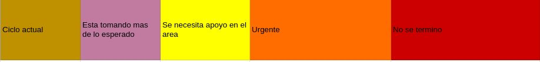

# Plan de trabajo 

El proyecto se dividio por semanas en ciclos de desarrollo o sprints.

Cada sprint tiene 5 dias de desarrollo, de jueves a martes, y 2 de entrega de productos, de martes a jueves.

Cuando inicia un nuevo sprint se actualiza el estado de las tareas.

Estas se miden por el siguiente semaforo:

El sprint actual esta marcado por el color dorado.
Cada que acaba un sprint el color de las tareas avanza segun el orden del semaforo.

Las tareas completadas se marcan de color verde.
Las tareas completadas antes de la fecha prevista se marcan de azul.

