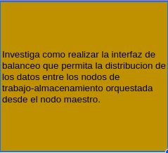
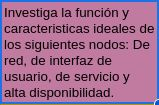
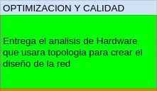

# Plan de trabajo 

El proyecto se dividio por semanas en ciclos de desarrollo o sprints.

Cada sprint tiene 5 dias de desarrollo, de jueves a martes, y 2 de entrega de productos, de martes a jueves.

Cuando inicia un nuevo sprint se actualiza el estado de las tareas.

Estas se miden por el siguiente semaforo:

