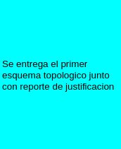

# Plan de trabajo 

El proyecto se dividio por semanas en ciclos de desarrollo o sprints.

Cada sprint tiene 5 dias de desarrollo, de jueves a martes, y 2 de entrega de productos, de martes a jueves.

Cuando inicia un nuevo sprint se actualiza el estado de las tareas.

Estas se miden por el siguiente semaforo:

El sprint actual esta marcado por el color dorado

Cada que acaba un sprint el color de las tareas avanza segun el orden del semaforo

Cuando se termina una tarea se actualiza su color a verde.

Si una tarea se entrega antes de tiempo previsto en el sprint se pone de color azul.

