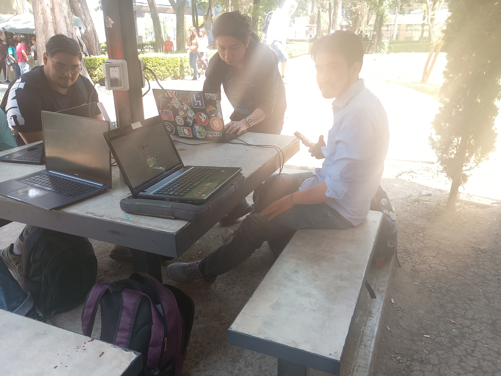
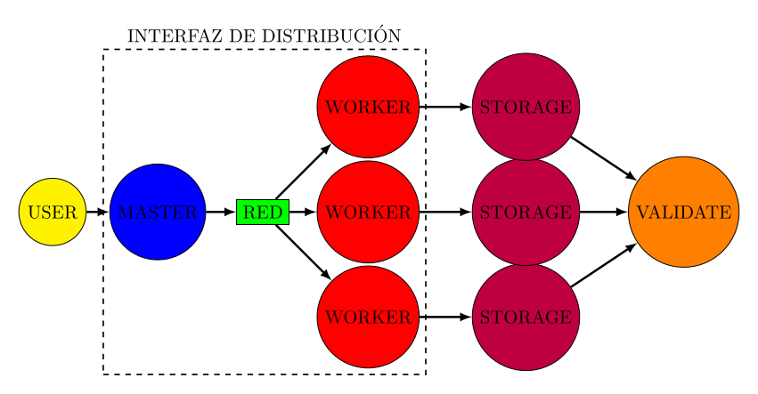

 
    <source  media="(prefers-color-scheme: dark)" srcset ="imagenes/logo-dorado.jpg">
    <source  media="(prefers-color-scheme: light)" srcset ="imagenes/logo_azul.png" >

    </picture>

# Cluster para Programacion Paralela y Concurrente 

 

En este momento estamos construyendo la siguiente interfaz:

Pasos a realizar:

    1-. Designar las computadoras que conformaran cada nodo.
    2-. Instalar un manejador de contenedores y la imagen del proyecto. 
    3-. Ejecutar un programa de prueba usando SPARK para distribuir 100GB de datos.

Entregables de cada area:

### Topologia

    Determina los equipos que conformaran cada nodo. 

### Redes

    Entrega mapa de red que incluye: Direccion ip fija, metodo de conexion 

### Administracion de Sistemas

    Programa el sistema de balanceo usando SPARK

### Automatizacion

    Propuesta de interfaz de usuario.

### Seguridad y pruebas 

    Coordina la prueba el dia jueves.

### Calidad y Optimizacion
    
    Valida los entregables de documentacion y programas.

### Documentacion

    Entrega manual de uso de modelos generativos de lenguajes.

* <a href="https://github.com/LuisMAC2022/PPC/tree/main/PlanTrabajo"> Se puede consultar el plan de trabajo aqui <a/>

* <a href="https://github.com/LuisMAC2022/PPC/blob/main/PDFs/readme.md">Directorio de recursos </a> 

Se ha generado la siguiente documentacion:

* <a href="https://www.github.com/Jorge95Cortes/dockerized-spark-cluster-set-up"> Dockerized Spark Cluster Setup </a> 

